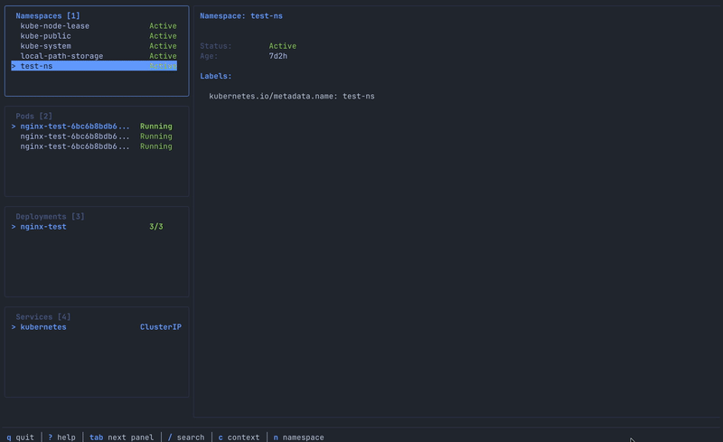

# lazy-k8s

[](https://go.dev/)
[](https://github.com/Starlexxx/lazy-k8s/actions/workflows/pr.yml)
[](https://github.com/Starlexxx/lazy-k8s/actions/workflows/release.yml)
[](https://goreportcard.com/report/github.com/Starlexxx/lazy-k8s)
[](https://opensource.org/licenses/MIT)

**A [lazygit](https://github.com/jesseduffield/lazygit)-style terminal UI for Kubernetes.** If you love lazygit’s keyboard-driven workflow, you’ll feel right at home managing your clusters with lazy-k8s.



## Why lazy-k8s?

|                      | lazy-k8s                                                 | k9s                                    |
| -------------------- | -------------------------------------------------------- | -------------------------------------- |
| **Navigation model** | lazygit-style multi-panel with `Tab`/`Shift+Tab`         | Single-pane with breadcrumb navigation |
| **Keybindings**      | Familiar if you use lazygit (`j/k`, `g/G`, `1-9` panels) | Custom keybinding system               |
| **Learning curve**   | Instant for lazygit users                                | Separate muscle memory to learn        |
| **Config**           | Simple YAML with theming                                 | Extensive plugin system                |
| **Focus**            | Fast, opinionated, minimal                               | Feature-rich, highly customizable      |

> **TL;DR** — If lazygit is your daily driver, lazy-k8s gives you the same feel for Kubernetes. If you need a power-user Swiss Army knife, k9s is great too.

## Features

- **Multi-panel layout** with keyboard-driven navigation
- **Real-time updates** using Kubernetes watch API
- **Resource management** for Namespaces, Pods, Deployments, Services, ConfigMaps, Secrets, Nodes, and Events
- **Pod operations** — logs (with follow mode), exec, port-forward, delete
- **Deployment operations** — scale, restart (rollout), rollback
- **Context and namespace switching** on the fly
- **Search/filter** within panels
- **YAML viewer** with syntax highlighting
- **Themeable** via config file

## Installation

### Homebrew (macOS/Linux)

```shell
brew tap Starlexxx/tap
brew install lazy-k8s
```

### Go Install

```shell
go install github.com/Starlexxx/lazy-k8s/cmd/lazy-k8s@latest
```

### From Source

```shell
git clone https://github.com/Starlexxx/lazy-k8s.git
cd lazy-k8s
task build
./bin/lazy-k8s
```

### Binary Releases

Download pre-built binaries from the [Releases page](https://github.com/Starlexxx/lazy-k8s/releases).

## Usage

```shell
# Use default kubeconfig
lazy-k8s

# Specify kubeconfig
lazy-k8s -k ~/.kube/config

# Use specific context
lazy-k8s -c my-cluster

# Start in specific namespace
lazy-k8s -n kube-system
```

## Keyboard Shortcuts

### Navigation

| Key         | Action         |
| ----------- | -------------- |
| `↑/k`       | Move up        |
| `↓/j`       | Move down      |
| `g`         | Go to top      |
| `G`         | Go to bottom   |
| `Tab`       | Next panel     |
| `Shift+Tab` | Previous panel |
| `1-9`       | Jump to panel  |
| `Enter`     | Select/expand  |
| `Esc`       | Back/cancel    |

### General

| Key            | Action                |
| -------------- | --------------------- |
| `?`            | Show help             |
| `q` / `Ctrl+c` | Quit                  |
| `/`            | Search/filter         |
| `Ctrl+r`       | Refresh               |
| `K`            | Switch context        |
| `n`            | Switch namespace      |
| `A`            | Toggle all namespaces |

### Resource Actions

| Key      | Action                 |
| -------- | ---------------------- |
| `d`      | Describe resource      |
| `y`      | View YAML              |
| `e`      | Edit resource          |
| `D`      | Delete (with confirm)  |
| `c`      | Copy resource name     |
| `Ctrl+y` | Copy YAML to clipboard |

### Pod Actions

| Key | Action              |
| --- | ------------------- |
| `l` | View logs           |
| `f` | Toggle follow logs  |
| `x` | Exec into container |
| `p` | Port forward        |

### Deployment Actions

| Key | Action            |
| --- | ----------------- |
| `s` | Scale             |
| `r` | Restart (rollout) |
| `R` | Rollback          |

## Configuration

Configuration file location: `~/.config/lazy-k8s/config.yaml`

```yaml
theme:
  primaryColor: "#7aa2f7"
    secondaryColor: "#9ece6a"
    errorColor: "#f7768e"
    warningColor: "#e0af68"
  backgroundColor: "#1a1b26"
    textColor: "#c0caf5"
    borderColor: "#3b4261"

  defaults:
    namespace: "default"
      logLines: 100
      followLogs: true
      refreshInterval: 5

    panels:
      visible:
          - namespaces
            - pods
              - deployments
              - services
```

## Requirements

- Go 1.25+
- kubectl configured with cluster access
- Terminal with 256 color support
- [Task](https://taskfile.dev/) (optional, for development)

## Building

```shell
# Build for current platform
task build

# Build for all platforms
task build:all

# Run the application
task run

# Run tests
task test

# Run tests with coverage
task test:coverage

# Run linter
task lint

# Run all checks (fmt, vet, lint, test)
task verify

# Show all available tasks
task --list
```

## Contributing

Contributions are welcome! Please see <CONTRIBUTING.md> for guidelines.

## License

[MIT License](LICENSE)
